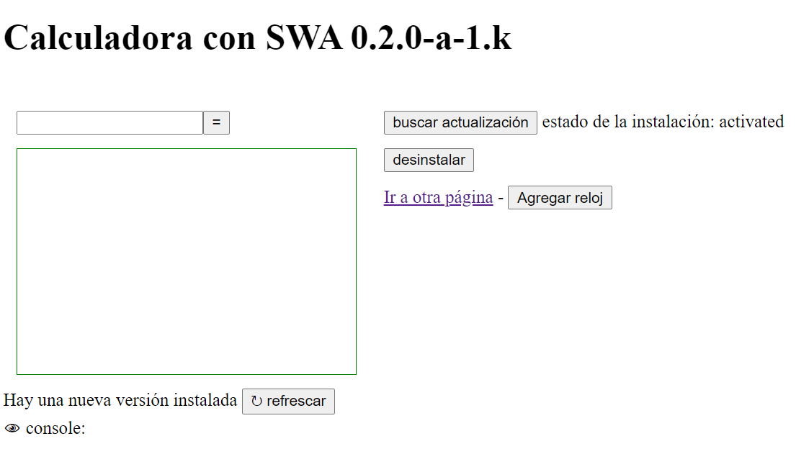
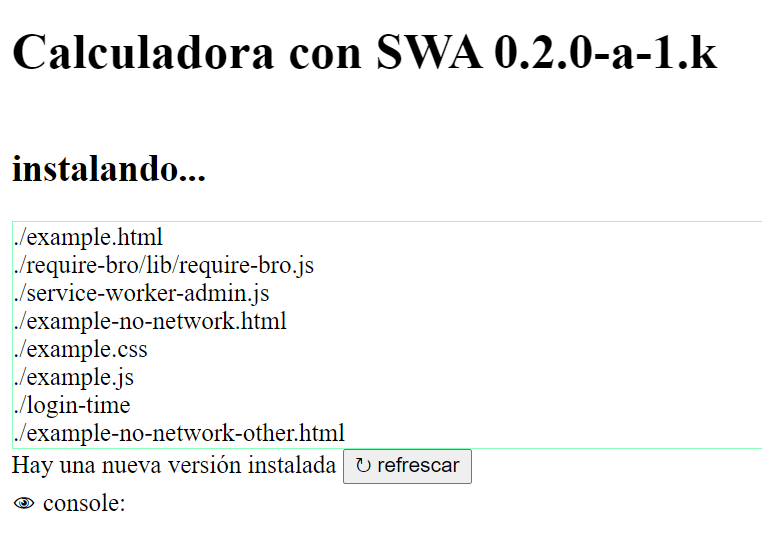
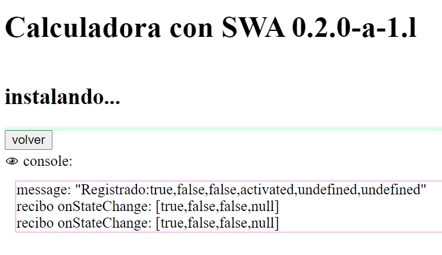

# pantallas para un swa 0.2.0-a.1

Cuando la app está instalada y hay un cambio de versión 
puede ocurrir o no que haya una petición a la red 
y el swa se entere en segundo plano que hay una nueva versión.

**Si eso ocurre** la aplicación debe mostrar un cartel avisándolo, 
y ofrecer un botón para refrescar y que se vea la nueva versión. 

En el ejemplo la leyenda dice _Hay una nueva versión instalada_ 
y el botón dice _↻ Refrescar_

**Para cuando eso no ocurre** la aplicación muestra un botón _Buscar actualización_
que le indica al swa que busque una nueva instalación, 
además muestra la pantalla _Instalando_ donde se ve el progreso de la instalación.

Al final de la instalación la aplicación avisa y ofrece el mismo botón _Refrescar_.

**Pero** el botón está y existe la posibilidad que al presionarlo 
no haya una nueva versión o que ya esté instalada 
pero por algún error de programación no detectemos que lo está
y por lo tanto no podamos poner el aviso de nueva versión. 

En esos casos **es importante** que haya una manera de volver a la aplicación,
por eso debe existir un botón volver, que recarge la página para que 
además de volver, le dé la oportunidad al swa de mostrar la nueva versión si está. 

